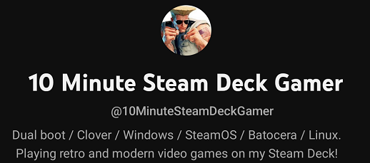

# SteamOS Android Waydroid Installer

A shell script to easily install / uninstall Android ([via Waydroid](https://waydro.id/)) on the Steam Deck running on SteamOS.

> **NOTE**\
> If you are going to use this script for a video tutorial, PLEASE reference on your video where you got the script! This will make the support process easier!
> And don't forget to give a shoutout to [@10MinuteSteamDeckGamer](https://www.youtube.com/@10MinuteSteamDeckGamer/) / ryanrudolf from the Philippines!

<b> If you like my work please show support by subscribing to my [YouTube channel @10MinuteSteamDeckGamer.](https://www.youtube.com/@10MinuteSteamDeckGamer/) </b> <br>
<b> I'm just passionate about Linux, Windows, how stuff works, and playing retro and modern video games on my Steam Deck! </b>

<p align="center">
<a href="https://www.youtube.com/@10MinuteSteamDeckGamer/">  </a>
</p>

<b>Monetary donations are also encouraged if you find this project helpful. Your donation inspires me to continue research on the Steam Deck! Clover script, 70Hz mod, SteamOS microSD, Secure Boot, etc.</b>

<b>Scan the QR code or click the image below to visit my donation page.</b>

<p align="center">
<a href="https://www.paypal.com/donate/?business=VSMP49KYGADT4&no_recurring=0&item_name=Your+donation+inspires+me+to+continue+research+on+the+Steam+Deck%21%0AClover+script%2C+70Hz+mod%2C+SteamOS+microSD%2C+Secure+Boot%2C+etc.%0A%0A&currency_code=CAD">  </a>
</p>

# Table of contents

- [Installation](#install-steps)

  - [Prerequisites](#prerequisites-for-steamos)
  - [How to install](#how-to-install)
  - [Installation video tutorial](#video-tutorial)

- [How to launch Waydroid after installing it](#launching-waydroid)

- [How to uninstall](#launching-waydroid)

- [Tutorials](#tutorials)

  - [Making a launcher that directly start a android app](#making-a-launcher-that-directly-start-a-android-app)
  - [How to enhance the SteamOS-Waydroid launcher or custom launchers in game mode with images](#how-to-enhance-the-steamos-waydroid-launcher-or-custom-launchers-in-game-mode-with-images)

  - [Video tutorials](#video-tutorials)
    - [How to Sideload APKs](https://youtu.be/LglEbSdRc0M)
    - [How to Upgrade the Android Image](https://youtu.be/lfwoZZxXh7I)
    - [How to Configure Fake Wi-Fi](https://youtu.be/LtMGmSSB52g)
    - [How to Configure Fake Touchscreen / Configure Mouse Clicks as Touchscreen Input](https://youtu.be/Xt2ceq8ZUJ8)

- [Important informations](#important-informations)

  - [A Note on SteamOS Updates](#a-note-on-steamos-updates)
  - [Troubleshooting and filing bug reports](#troubleshooting-and-filing-bug-reports)

- [Tested games](#tested-games)

  - [Games i have personally tested that are functional with demo gameplay](#games-i-have-personally-tested-that-are-functional-with-demo-gameplay)
  - [Games Tested by the community](#games-tested-by-the-community)

- [Geekbench Benchmark Result Between OLED and LCD on SteamOS Android Waydroid](#geekbench-benchmark-result-between-oled-and-lcd-on-steamos-android-waydroid)
- [Disclaimer](#disclaimer)

# Changelogs

## What's New (as of February 11 2024)

1. Added support for latest SteamOS Preview 3.5.15 - kernel 6.1.52-valve16-1-neptune-61

<details>
      <summary>Previous changelogs</summary>

## What's New (as of February 10 2024)

1. [lower audio latency](https://github.com/ryanrudolfoba/SteamOS-Waydroid-Installer/issues/22)
2. added more sanity checks

## What's New (as of February 07 2024)

1. removed weston. been testing cage for several weeks now and this is way better than weston.
2. added custom hosts file to block ads

### [Click here to view all the previous CHANGELOGS](https://github.com/ryanrudolfoba/SteamOS-Waydroid-Installer/blob/main/CHANGELOG.md)

</details><br>

# Install Steps

Read the sections below carefuly!

## Prerequisites for SteamOS

- sudo password should already be set by the end user. If sudo password is not yet set, the script will ask to set it up.

> [!WARNING]
> If you are using a older version of the script: \
> [Uninstall first](#i-dont-want-this-anymore-i-want-to-uninstall)

## How to install

1. Go into Desktop Mode and open a konsole terminal.
2. Clone the github repo.
   ```
   cd
   git clone https://github.com/ryanrudolfoba/steamos-waydroid-installer
   ```
3. Execute the script!
   ```
   cd ~/steamos-waydroid-installer
   chmod +x steamos-waydroid-installer.sh
   ./steamos-waydroid-installer.sh
   ```
4. Script will automatically install Waydroid together with the custom config. Install will roughly take around 5mins depending on the internet connection speed.
5. Once done exit the script and go back to Game Mode.

## Video Tutorial

[Click the image below for a video tutorial and to see the functionalities of the script!](https://youtu.be/06T-h-jPVx8?si=pTWAlmcYyk9fHa38)

<p align="center">
<a href="https://youtu.be/06T-h-jPVx8?si=pTWAlmcYyk9fHa38">  </a>
</p>

# Launching Waydroid

1. Go to Game Mode.
2. Run the Android_Waydroid_Cage launcher.

# How to uninstall

1. Go to Desktop Mode.
2. Open konsole terminal and type the commands
   ```
   cd ~/Android_Waydroid
   ./uninstall.sh
   ```
3. Enter the sudo password when prompted.
4. Waydroid and the custom configs will be uninstalled.
5. Delete the Android_Waydroid_Cage and Android_Waydroid_Weston shortcuts in Game Mode.
6. OPTIONAL - Delete the steamos-nested-desktop shortcut in Game Mode.

# Tutorials

## Making a launcher that directly start a android app

> [!WARNING] \
> Here we gonna make one for `Firefox` so adapt for your use case.

For that we gonna need to get the app `packageName`. There are two ways to getting it:

- In the terminal (covered in the tutorial)

- On android, long touch the app to make the menu appear and clic on the `!` icon. At the bottom clic on Advanced. The `packageName` is in the last line at the bottom.

1. Go into Desktop Mode and open a konsole terminal.
2. Move to the `Android_Waydroid` folder.
   ```
   cd ~/steamos-waydroid-installer
   ```
3. Now we need to make a copy of `template.sh` with the name of the app we want.
   ```
   cp template.sh firefox.sh
   ```
4. (You can skip this step if you have use the android method for getting the `packageName`)

   ```
   waydroid app list | grep -i "firefox" -A1
   ```

   You will have a output that will look like this one:

   ```
   Name: Firefox
   packageName: org.mozilla.firefox
   ```

5. Copy the `packageName` (here its `org.mozilla.firefox`)

6. Now we need to open the script we previously copied for editing it (You can replace `nano` with `kate` if you prefer a GUI text editor).

   ```
   nano netflix.sh
   ```

   The content will look like that:

   ```bash
   #!/bin/bash

   # Launch Waydroid via cage, don't show UI
   wlr-randr --output X11-1 --custom-mode 1280x800@60Hz
   /usr/bin/waydroid session start $@ &

   sleep 15
   sudo /usr/bin/waydroid-fix-controllers

   # launch the android app automatically
   /usr/bin/waydroid app launch com.netflix.mediaclient &
   ```

7. In the last line, replace `com.netflix.mediaclient` with `org.mozilla.firefox`. Save and close the file after that (With `nano`: ctrl+S then ctrl+x)

8. The script is done, we just need to make it executable.
   ```
   chmod +x firefox.sh
   ```
9. Next, we need to open dolphin, move to `~/steamos-waydroid-installer` and add `Android_Waydroid_Cage.sh` in the steam library by right clicking on it and selecting `Add to Steam`.

   You can use the following command to opening it faster:

   ```
   dolphin ~/steamos-waydroid-installer
   ```

10. After that, on open the steam library, right clic the new library entry then clic on `Properties` and replace the content of the `target` textbox like below.

```
/home/deck/Android_Waydroid/Android_Waydroid_Cage.sh" firefox
```

Don't forget to rename the shortcut/launcher (first textbox).

## How to enhance the SteamOS-Waydroid launcher or custom launchers in GameMode with images

The easiest way, is to use [SteamGridDB](https://github.com/steamgriddb) to accomplish that. Depending of you need/situation, multiple version exist:

- [SGDBoop](https://www.steamgriddb.com/boop) If you want to using it in desktop mod.
- [decky-steamgriddb](https://www.steamgriddb.com/boop) To using it in game mode, require the use of [Decky loader](https://github.com/SteamDeckHomebrew/decky-loader).

## Video tutorials:

- [How to Sideload APKs](https://youtu.be/LglEbSdRc0M)
- [How to Upgrade the Android Image](https://youtu.be/lfwoZZxXh7I)
- [How to Configure Fake Wi-Fi](https://youtu.be/LtMGmSSB52g)
- [How to Configure Fake Touchscreen / Configure Mouse Clicks as Touchscreen Input](https://youtu.be/Xt2ceq8ZUJ8)

# Important informations

## A Note on SteamOS Updates

> [!WARNING] \
> When there is a SteamOS update the waydroid will be wiped. This is normal behavior due to how SteamOS applies updates. \
> Re-run the script again BUT if the SteamOS update contains a new kernel version the script will exit immediately. \
> Please file an issue report when this happens so I can compile a binder kernel module to match the SteamOS update.

## Troubleshooting and filing bug reports

1. If you encounter an issue with the script, try to [uninstall](https://github.com/ryanrudolfoba/SteamOS-Waydroid-Installer/tree/main#i-dont-want-this-anymore-i-want-to-uninstall), clone the repo again and perform an install.\
   Reason for that - you might be using an older version of my script and a new version might have already fixed your issue.
2. If uninstall / reinstall didn't help, open an issue and please be descriptive as possible. \
   At the minimum include this when filing an issue - \
   SteamOS version - \
   Error message encountered - \
   Screenshot of error - \
   Do you have any scripts / tweaks that might be causing issues?
3. Downloads are slow when acquiring the waydroid image. This is similar to this [issue](https://github.com/ryanrudolfoba/SteamOS-Waydroid-Installer/issues/26). \
   Answer - You might have connected to a slow sourceforge mirror. Press CTRL-C to cancel the download and re-run the script again.
4. No shortcuts in Game Mode after running the script / Unsupported File Type when adding shortcuts. This is similar to this [issue](https://github.com/ryanrudolfoba/SteamOS-Waydroid-Installer/issues/25). \
   Answer - This issue happens if Steam client cant be run because the script was called from an ssh or virtual tty session. Make sure to run the script on Desktop Mode via konsole.

# Tested games

This is a Work in Progress - both lists will be updated accordingly. \
If you wish to contribute, please check the [google sheets](https://docs.google.com/spreadsheets/d/1pyqQw2XKJZBtGYBV0i7C510dyjVSU2YndhaTOEDavdU/edit?usp=sharing) and include the game name, how it runs etc etc.

## Games i have personally tested that are functional with demo gameplay

- [Plants vs Zombies](https://youtu.be/rnb0z1LtDN8) - Feb 04 2024
- [Honkai Star Rail](https://youtu.be/M1Y9DMG9rbM) - Feb 06 2024
- [Asphalt 8 Airborne](https://youtu.be/OCaatZdZR1I) - Feb 08 2024
- [Honkai Impact 3rd](https://youtu.be/6YdNOJ0u2KM) - Feb 10 2024
- [Mobile Legends](https://youtu.be/PlPRNn92NDI) - Feb 13 2024
- [T3 Arena](https://youtu.be/wq87nd3MCrQ?si=h4A7NEwEFGujF7hH) - Feb 16 2024
- [Warcraft Rumble](https://youtu.be/rnb0z1LtDN8) - Feb 19 2024
- [Diablo Immortal](https://youtu.be/4lJOnGnEJjw) - Feb 21 2024
- [Oceanhorn](https://youtu.be/vKPJZeyw0DI) - Feb 23 2024

## Games tested by the community

Please check this [google sheets](https://docs.google.com/spreadsheets/d/1pyqQw2XKJZBtGYBV0i7C510dyjVSU2YndhaTOEDavdU/edit?usp=sharing) for games tested by the community. \
Please feel free to add your game testing in there too! Thank you!

# Geekbench Benchmark Result Between OLED and LCD on SteamOS Android Waydroid

[Geekbench Result](https://youtu.be/56YGZsU5j74) - Feb 11 2024

# Disclaimer

1. Do this at your own risk!
2. This is for educational and research purposes only!
